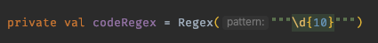
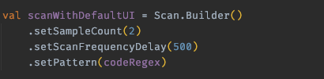
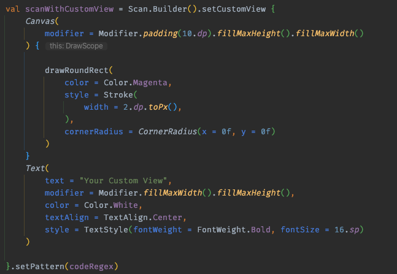
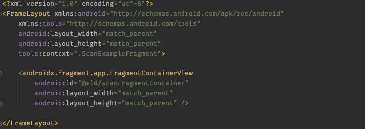
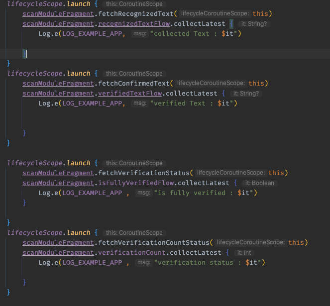
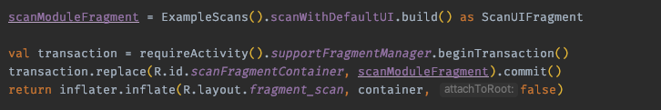

# sumo

#  :confetti_ball: Scanning Utility Module with OCR :confetti_ball:

SUMO is a library to recognize text from images. 
The library ships with a default UI and an verifying process to counteract misreads from the OCR.

- Comes with an **user interface** out of the box
- **Easy implementation** through a single fragment
- Internal **verification mechanism** to guarantee the correct output 
- **Highly Customizable** for all your needs
- You decide how fast and how secure your scan should be
- Realize easy **UI feedback**
- Fits into any architecture

SUMO uses the newest ML Kit models which are available for beta for the highest success rate. Check out **[ML Kit](https://developers.google.com/ml-kit/vision/text-recognition/v2)** to learn more about text recognition and machine learning.
## Implementation

A simple implementation could look like this:

### Step 1:

Think about whether you want a verification mechanism and what data you want to verify.
If you have data you need to make sure to recognize correctly create a Regex which matches your data.

Configure your scan with your desired options

if you need a custom UI use **Jetpack Compose** to create your own.

***Note: You might need additional Jetpack Compose dependencies, if your project is not using it already check out **[Compose](https://developer.android.com/jetpack/compose)**.  The example app has all dependencies needed.***

Make sure to place a FragmentContainerView if you are using a XML Layout.

Before you start scanning listen to the data which will be scanned. The verified text is your desired pattern. You are always granted access to the whole recognized text by the OCR. With that you can adjust the scanning process by your needs. 

As soon as you make a transaction and commit the ScanUIFragment you are all set to start scanning.

Look through the example app to see different approaches of scan instances. You are free to create the matching scan module for your application.

# Happy Scanning! #
